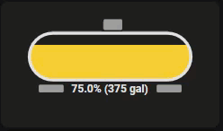
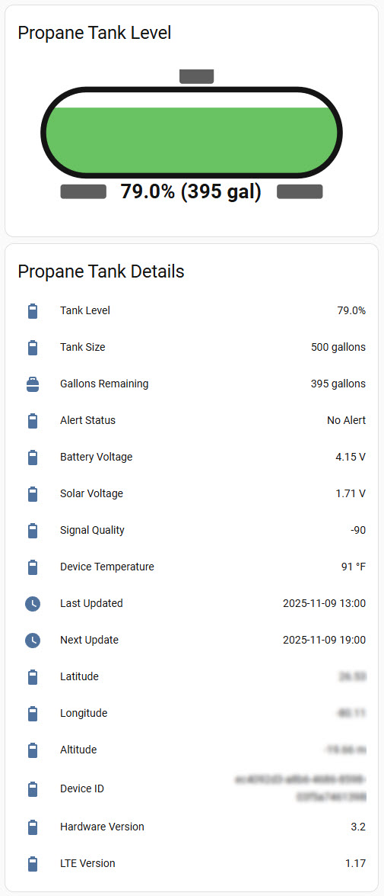
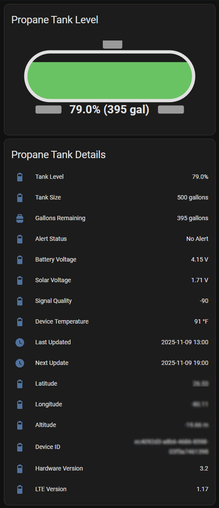
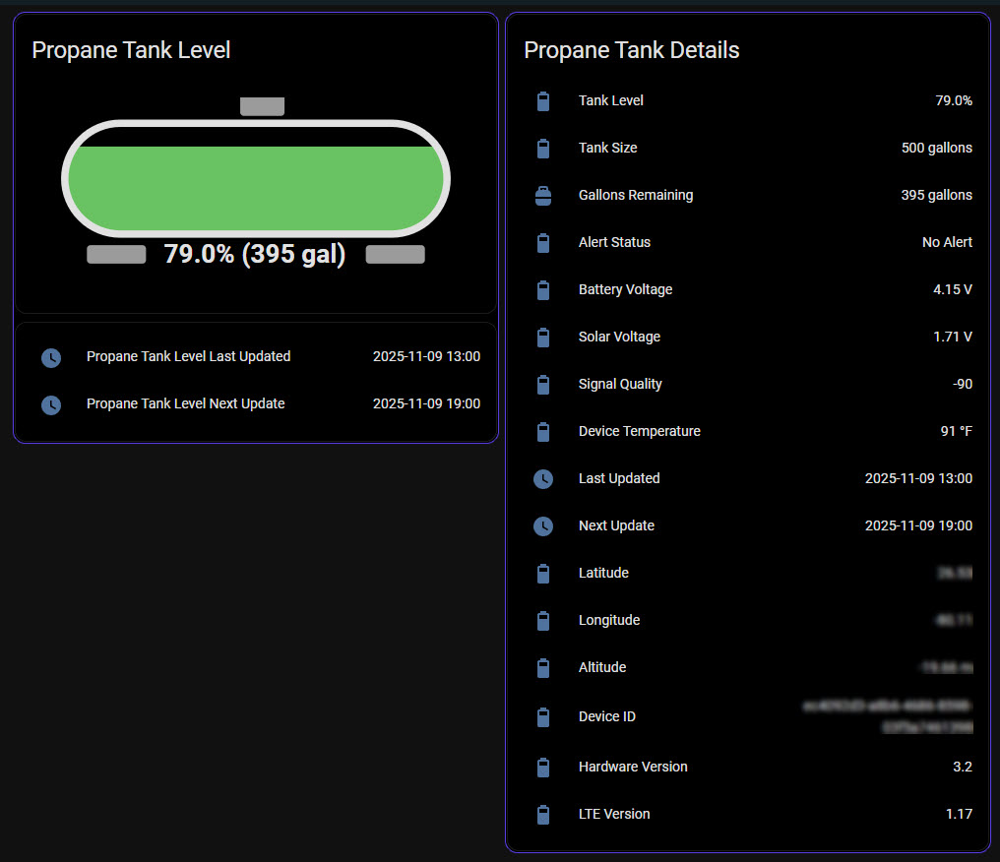
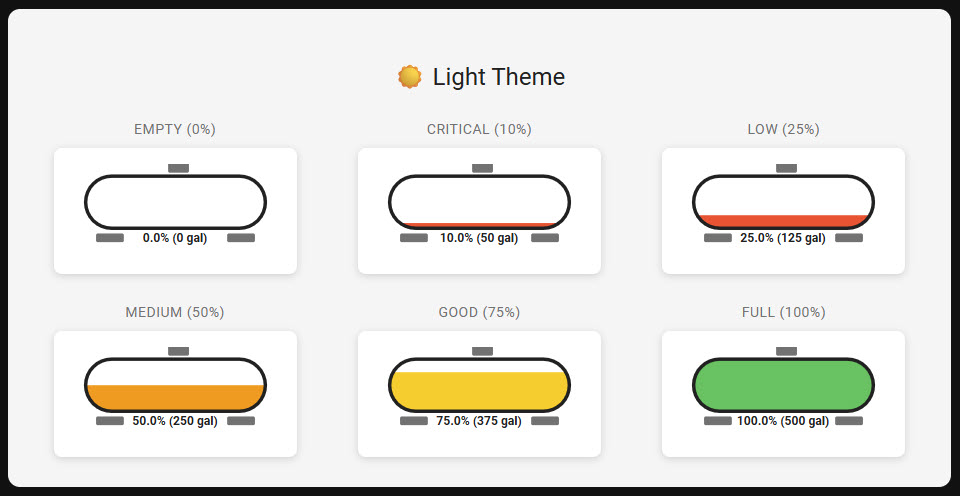
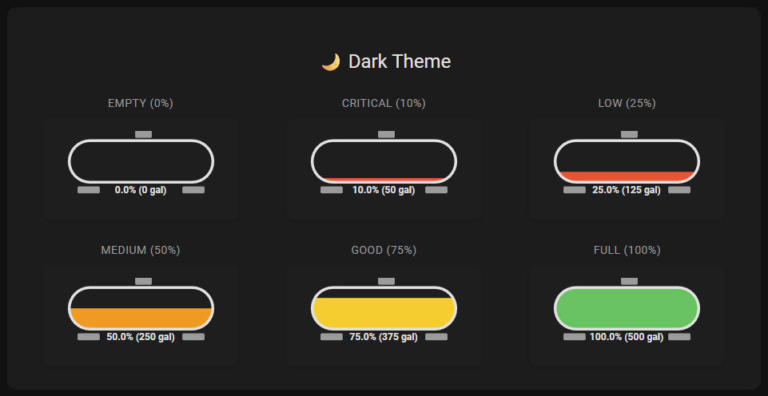

# Centri Propane Tank Level Home Assistant Horizontal Card

A custom Home Assistant Lovelace card that displays propane tank levels with a visual horizontal tank representation.

This card and instructions are designed and tested to work with the [Centri MyPropane Tank Monitor](https://www.centriconnect.com/) and their API. The card itself can always be adapted to work with other propane monitoring systems that provide percentage-based level sensors.



## Light & Dark Theme Support

| Light Theme | Dark Theme |
|-------------|------------|
|  |  |

### Styled Card Examples



### Level Examples

| Light Theme Levels | Dark Theme Levels |
|-------------------|-------------------|
|  |  |

## Features

- Visual horizontal propane tank display
- Color-coded levels (red ≤25%, orange ≤50%, yellow ≤75%, green >75%)
- Displays percentage and estimated gallons
- Smooth animations when level changes
- Handles unavailable sensor states gracefully
- Follows Home Assistant theming

## Installation

### HACS (Recommended)

1. Make sure [HACS](https://hacs.xyz/) is installed in your Home Assistant
2. Go to HACS → Frontend
3. Click the three dots menu (top right) and select "Custom repositories"
4. Add this repository URL: `https://github.com/royf007/ha-centri-propane-tank-card`
5. Select category: "Dashboard"
6. Click "Add"
7. Search for "Propane Tank Horizontal Card" and install it
8. Restart Home Assistant

### Manual Installation

1. Download `ha-centri-propane-tank-card.js` from the [latest release](https://github.com/royf007/ha-centri-propane-tank-card/releases)
2. Copy the file to your `config/www` directory (create the `www` directory if it doesn't exist)
3. Add the resource to your Lovelace dashboard:
   - Go to Settings → Dashboards → Resources (three dots menu, top right)
   - Click "Add Resource"
   - URL: `/local/ha-centri-propane-tank-card.js`
   - Resource type: JavaScript Module
   - Click "Create"
4. Restart Home Assistant

## Configuration

Add the card to your Lovelace dashboard:

### Basic Configuration

```yaml
type: custom:ha-centri-propane-tank-card
entity: sensor.centri_tank_level
```

### Advanced Configuration

```yaml
type: custom:ha-centri-propane-tank-card
entity: sensor.centri_tank_level
tank_size: 500  # Optional: Tank capacity in gallons (default: 500)
```

> [!NOTE]
> Make sure to update `tank_size` to match your actual propane tank capacity for accurate gallon calculations. The default is 500 gallons.

### Card Options

| Name | Type | Required | Default | Description |
|------|------|----------|---------|-------------|
| `type` | string | **Yes** | - | Must be `custom:ha-centri-propane-tank-card` |
| `entity` | string | **Yes** | - | Entity ID of your propane tank level sensor (should report 0-100) |
| `tank_size` | number | **No** | 500 | Tank capacity in gallons for gallon calculation |

## Setup Requirements

Your Home Assistant must have a sensor that reports propane tank level as a percentage (0-100).

### Setting Up a Propane Tank Sensor

For detailed examples of configuring your propane tank sensor, see the [`examples/`](examples/) folder:

**Centri Propane Tank Monitor:**
If you have a [Centri propane tank monitor](https://www.centriconnect.com/), follow these steps:

1. **Get your API credentials from Centri:**
   - Log into your Centri account
   - Obtain your Account ID, Device ID, and API Key (device_auth)

2. **Add the REST sensor configuration:**
   - Use the template from [`examples/centri-rest-configuration.yaml`](examples/centri-rest-configuration.yaml)
   - Add it to your `configuration.yaml` (or `sensors.yaml` if using split configuration)
   - Replace these placeholders:
     - `YOUR_ACCOUNT_ID` - Your Centri account ID
     - `YOUR_DEVICE_ID` - Your Centri device ID  
     - `YOUR_API_KEY` - Your device authentication key

3. **Restart Home Assistant**

4. **Verify the sensor:**
   - Go to Developer Tools → States
   - Look for `sensor.centri_tank_level`
   - Verify it shows your tank level percentage

The sensor updates every 6 hours and provides attributes like tank size, battery voltage, signal quality, and GPS coordinates.

**Other Sensors:**
If you have a different propane monitor, ensure your sensor reports values between 0-100 as a percentage.

## Screenshots

Add screenshots of your card in action to the `screenshots/` directory.

## Example Configurations

Check the [`examples/`](examples/) folder for complete Home Assistant dashboard configurations:

### Centri REST API Configuration

[`examples/centri-rest-configuration.yaml`](examples/centri-rest-configuration.yaml) - REST sensor configuration for Centri propane tank monitors.

**What you need:**

- Centri account credentials (Account ID, Device ID, API Key)
- Add this to your `configuration.yaml` or `sensors.yaml`
- See [Setting Up a Propane Tank Sensor](#setting-up-a-propane-tank-sensor) section above for detailed instructions

```yaml
  - platform: rest
    name: Centri Tank Level
    unique_id: "centri_tank_level"
    resource: https://api.centriconnect.com/centriconnect/YOUR_ACCOUNT_ID/device/YOUR_DEVICE_ID/all-data
    method: GET
    params:
      device_auth: "YOUR_API_KEY"
    scan_interval: 21600 # Updates every 6 hours
    value_template: "{{ value_json['YOUR_DEVICE_ID']['TankLevel'] }}"
    unit_of_measurement: "%"
    state_class: measurement
    json_attributes_path: "$.YOUR_DEVICE_ID"
    json_attributes:
      - AlertStatus
      - Altitude
      - BatteryVolts
      - DeviceID
      - DeviceName
      - DeviceTempCelsius
      - DeviceTempFahrenheit
      - LastPostTimeIso
      - Latitude
      - Longitude
      - NextPostTimeIso
      - SignalQualLTE
      - SolarVolts
      - TankSize
      - TankSizeUnit
      - VersionHW
      - VersionLTE
    device_class: battery # Using battery as it's a level measurement
```

### Basic Card

[`examples/centri-propane-card-basic.yaml`](examples/centri-propane-card-basic.yaml) - The simplest card configuration showing the propane tank with update timestamps.

**Features:**

- Clean, minimal design
- Propane tank visualization
- Update timestamp display

```yaml
type: custom:mod-card
card:
  type: vertical-stack
  cards:
    - type: custom:ha-centri-propane-tank-card
      entity: sensor.centri_tank_level
      tank_size: 500
    - type: entities
      entities:
        - entity: sensor.propane_tank_last_updated_est
          name: Propane Tank Level Last Updated
        - entity: sensor.propane_tank_next_update_est
          name: Propane Tank Level Next Update
```

### Styled Card

[`examples/centri-propane-card.yaml`](examples/centri-propane-card.yaml) - A styled card with the propane tank visualization and additional entity information using [`card-mod`](https://github.com/thomasloven/lovelace-card-mod) for custom styling.

**Features:**

- Animated pulsing border effect
- Black background with transparent styling
- Vertical stack with tank display and update timestamps

```yaml
type: custom:mod-card
style: |
  ha-card {
    background-color: #000000;
    border: 1px solid #000000;
    border-radius: 12px;
    animation: pulse-shadow-energy 5s infinite alternate;
    padding: 0 !important;
   }
  :host {
    --ha-card-padding: 0;
   }
  ha-card > :first-child {
    padding: 0;
   }
  card-content {
    padding: 0;
   }
  @keyframes pulse-shadow-energy {
     0% {
       box-shadow: 0 0 0.0625rem 0.0625rem #FF00E0;
     }
     50% {
       box-shadow: 0 0 0.0625rem 0.09375rem #0055FF;
     }
     100% {
       box-shadow: 0 0 0.0625rem 0.125rem #FF8C00;
     }
   }
card:
  type: vertical-stack
  cards:
    - type: custom:ha-centri-propane-tank-card
      entity: sensor.centri_tank_level
      tank_size: 500
      card_mod:
        style: |
          ha-card {
            background-color: #000000 !important;
          }
          .tank-container {
            background-color: transparent !important;
          }
    - type: entities
      entities:
        - entity: sensor.propane_tank_last_updated_est
          name: Propane Tank Level Last Updated
        - entity: sensor.propane_tank_next_update_est
          name: Propane Tank Level Next Update
      card_mod:
        style: |
          ha-card {
            background-color: #000000 !important;
          }
          .card-content {
            background-color: transparent !important;
          }
```

### Detailed Information Card (Basic)

[`examples/centri-propane-details-card-basic.yaml`](examples/centri-propane-details-card-basic.yaml) - A comprehensive details card showing all tank information without custom styling.

**Features:**

- Tank size and remaining gallons
- Battery and solar voltage
- Signal quality and device temperature
- GPS location (latitude, longitude, altitude)
- Hardware and LTE version info
- Update timestamps

```yaml
type: custom:mod-card
card:
  type: entities
  title: Propane Tank Details
  entities:
    - entity: sensor.centri_tank_level
      name: Tank Level
    - entity: sensor.centri_tank_level
      type: attribute
      attribute: TankSize
      name: Tank Size
      suffix: " gallons"
    - entity: sensor.propane_tank_remaining_gallons
      name: Gallons Remaining
    - entity: sensor.centri_tank_level
      type: attribute
      attribute: AlertStatus
      name: Alert Status
    - entity: sensor.centri_tank_level
      type: attribute
      attribute: BatteryVolts
      name: Battery Voltage
      suffix: " V"
    - entity: sensor.centri_tank_level
      type: attribute
      attribute: SolarVolts
      name: Solar Voltage
      suffix: " V"
    - entity: sensor.centri_tank_level
      type: attribute
      attribute: SignalQualLTE
      name: Signal Quality
    - entity: sensor.centri_tank_level
      type: attribute
      attribute: DeviceTempFahrenheit
      name: Device Temperature
      suffix: " °F"
    - entity: sensor.propane_tank_last_updated_est
      name: Last Updated
    - entity: sensor.propane_tank_next_update_est
      name: Next Update
    - entity: sensor.centri_tank_level
      type: attribute
      attribute: Latitude
      name: Latitude
    - entity: sensor.centri_tank_level
      type: attribute
      attribute: Longitude
      name: Longitude
    - entity: sensor.centri_tank_level
      type: attribute
      attribute: Altitude
      name: Altitude
      suffix: " m"
    - entity: sensor.centri_tank_level
      type: attribute
      attribute: VersionHW
      name: Hardware Version
    - entity: sensor.centri_tank_level
      type: attribute
      attribute: VersionLTE
      name: LTE Version
```

### Detailed Information Card (Styled)

[`examples/centri-propane-details-card.yaml`](examples/centri-propane-details-card.yaml) - A comprehensive details card with custom styling using [`card-mod`](https://github.com/thomasloven/lovelace-card-mod).

**Features:**

- All information from the basic version
- Animated pulsing border effect
- Black background with custom styling

```yaml
type: custom:mod-card
style: |
  ha-card {
    background: black;
    border: 1px solid #000000;
    border-radius: 12px;
    animation: pulse-shadow-energy 5s infinite alternate;
    --ha-card-background: "rgba(10, 10, 30, 0.0)";
   }
   @keyframes pulse-shadow-energy {
     0% {
       box-shadow: 0 0 0.0625rem 0.0625rem #FF00E0;
     }
     50% {
       box-shadow: 0 0 0.0625rem 0.09375rem #0055FF;
     }
     100% {
       box-shadow: 0 0 0.0625rem 0.125rem #FF8C00;
     }
    
   }
card:
  type: entities
  title: Propane Tank Details
  entities:
    - entity: sensor.centri_tank_level
      name: Tank Level
    - entity: sensor.centri_tank_level
      type: attribute
      attribute: TankSize
      name: Tank Size
      suffix: " gallons"
    - entity: sensor.propane_tank_remaining_gallons
      name: Gallons Remaining
    - entity: sensor.centri_tank_level
      type: attribute
      attribute: AlertStatus
      name: Alert Status
    - entity: sensor.centri_tank_level
      type: attribute
      attribute: BatteryVolts
      name: Battery Voltage
      suffix: " V"
    - entity: sensor.centri_tank_level
      type: attribute
      attribute: SolarVolts
      name: Solar Voltage
      suffix: " V"
    - entity: sensor.centri_tank_level
      type: attribute
      attribute: SignalQualLTE
      name: Signal Quality
    - entity: sensor.centri_tank_level
      type: attribute
      attribute: DeviceTempFahrenheit
      name: Device Temperature
      suffix: " °F"
    - entity: sensor.propane_tank_last_updated_est
      name: Last Updated
    - entity: sensor.propane_tank_next_update_est
      name: Next Update
    - entity: sensor.centri_tank_level
      type: attribute
      attribute: Latitude
      name: Latitude
    - entity: sensor.centri_tank_level
      type: attribute
      attribute: Longitude
      name: Longitude
    - entity: sensor.centri_tank_level
      type: attribute
      attribute: Altitude
      name: Altitude
      suffix: " m"
    - entity: sensor.centri_tank_level
      type: attribute
      attribute: DeviceID
      name: Device ID
    - entity: sensor.centri_tank_level
      type: attribute
      attribute: VersionHW
      name: Hardware Version
    - entity: sensor.centri_tank_level
      type: attribute
      attribute: VersionLTE
      name: LTE Version
```

### Automation (Optional)

[`examples/centri-automation.yaml`](examples/centri-automation.yaml) - Optional automation to update the Centri sensor on Home Assistant startup.

**What you need:**

- Add this to your `automations.yaml` or create it via the Home Assistant UI
- This is optional but recommended to ensure fresh data immediately after Home Assistant restarts
- Without this, the sensor will update on its regular 6-hour schedule

```yaml
alias: "Update Centri Tank Level on Startup"
description: "Updates the Centri propane tank sensor when Home Assistant starts"
trigger:
  - platform: homeassistant
    event: start
action:
  - delay:
      seconds: 30  # Wait 30 seconds for Home Assistant to fully initialize
  - service: homeassistant.update_entity
    target:
      entity_id: sensor.centri_tank_level
mode: single
```

### Template Sensors

[`examples/templates.yaml`](examples/templates.yaml) - Template sensors for Centri data processing.

**What you need:**

- Add this to your `configuration.yaml` under `template:` or include it from a separate file
- These templates provide:
  - **Timestamp conversion**: Converts UTC timestamps from the API to your local timezone (EST in this example)
  - **Gallon calculations**: Calculates remaining gallons based on tank level percentage and tank size

> [!NOTE]
> The timestamp templates use EST (UTC-4). Adjust the `timedelta(hours=4)` to match your timezone offset from UTC.

```yaml
# Centri Propane Tank

- sensor:
    - name: "Propane Tank Last Updated EST"
      state: >
        
        
          
          {% set est_time = now().strptime(time, '%Y-%m-%d %H:%M:%S') - timedelta(hours=4) %}
          {{ est_time.strftime('%Y-%m-%d %H:%M') }}
        
          Unknown
        
      icon: mdi:clock

    - name: "Propane Tank Next Update EST"
      state: >
        
        
          
          {% set est_time = now().strptime(time, '%Y-%m-%d %H:%M:%S') - timedelta(hours=4) %}
          {{ est_time.strftime('%Y-%m-%d %H:%M') }}
        
          Unknown
        
      icon: mdi:clock

    - name: "Propane Tank Remaining Gallons"
      unit_of_measurement: "gallons"
      state: >
        
        
        
          {{ (tank_size | float(0) * tank_level / 100) | int }}
        
          Unknown
        
      icon: mdi:propane-tank
```

**Note:** These examples use additional custom components:

- [`card-mod`](https://github.com/thomasloven/lovelace-card-mod) - For custom styling

## Contributing

Contributions are welcome! Please open an issue or submit a pull request.

## License

This project is licensed under the MIT License - see the [LICENSE](LICENSE) file for details.

## Support

If you find this card helpful, please star the repository on GitHub!

## Changelog

### Version 1.0.0

- Initial release
- Horizontal propane tank visualization
- Color-coded level indicators
- Support for unavailable sensor states
